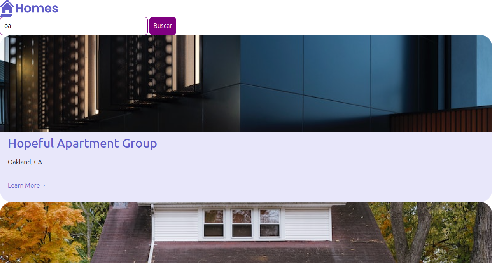

# 🏡 Housing Locations App

Este é um projeto Angular que exibe **locais de habitação disponíveis**, com a possibilidade de enviar uma aplicação para moradia. Ele utiliza:

- ✅ Angular 17+
- ✅ `json-server` como backend fake
- ✅ Componentes standalone
- ✅ `ReactiveForms` para formulários

---

## 📸 Imagem de exemplo



---

## 🚀 Como rodar o projeto

Siga os passos abaixo para rodar a aplicação localmente:

### 1. Clone o repositório

```bash
git clone https://github.com/seu-usuario/seu-repo.git
cd seu-repo
```

### 2. Instale as dependências

```bash
npm install
```

### 3. Inicie o backend (fake API)

Este projeto usa `json-server` para simular uma API. Certifique-se de ter ele instalado globalmente:

```bash
npm install -g json-server
```

Depois, inicie o servidor:

```bash
json-server --watch db.json --port 3000
```

> O arquivo `db.json` já está configurado com dados iniciais.

### 4. Inicie o frontend Angular

Em outro terminal:

```bash
ng serve
```

Abra o navegador em `http://localhost:4200` e veja o app funcionando 🎉

---

## 🧩 Funcionalidades

- Listagem de casas disponíveis
- Detalhes de cada casa
- Aplicação com nome, sobrenome e e-mail
- Estilo visual responsivo com imagens reais
- Roteamento com `ActivatedRoute` funcionando corretamente

---

## 📁 Estrutura de arquivos (resumida)

```
src/
├── app/
│   ├── casa-serv.service.ts      // Serviço para obter dados da API
│   ├── casalocalizacao.ts        // Interface da casa
│   ├── home/                     // Página principal
│   ├── details/                  // Página de detalhes da casa
│   ├── app.routes.ts            // Rotas configuradas
│   └── app.component.ts         // Componente principal
├── assets/
│   └── imagens/...
├── db.json                       // Backend fake com json-server
```

---

## 💡 Dicas

- Se der erro `No provider for ActivatedRoute`, verifique se o `provideRouter(routes)` está presente no `main.ts`.
- Se quiser adicionar novas casas, edite o arquivo `db.json`.

---

## 🛠️ Requisitos

- Node.js 18+
- Angular CLI
- json-server

---

## 🤝 Contribuições

Contribuições são muito bem-vindas! Sinta-se à vontade para abrir issues ou pull requests.
